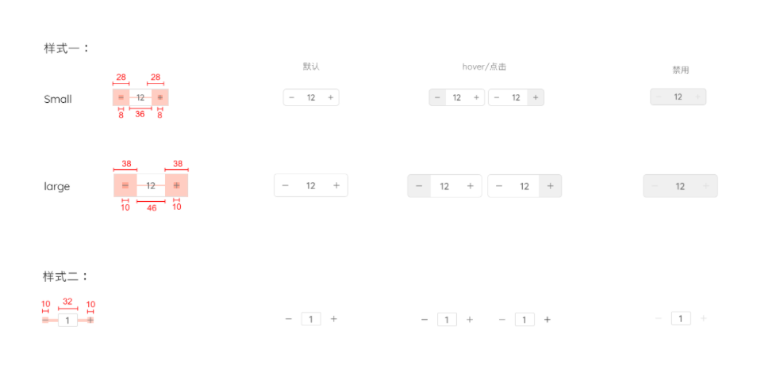

# Counter

| 属性     | 说明           | 类型                     | 默认值    |
| -------- | -------------- | ------------------------ | --------- |
| size     | counter尺寸    | large \|small \|medium   | large     |
| disabled | 禁用状态       | boolean                  | false     |
| bordered | 是否有边框     | boolean                  | true      |
| step     | 每次点击的步数 | number                   | 1         |
| value    | 当前counter值  | number                   | -         |
| maxValue | 能输入最大值   | number                   | Infinity  |
| minValue | 能输入最小值   | number                   | -Infinity |
| onChange | 更改数值回调   | （value: number） => any | -         |

## 基础使用



```react
<ReoCounter bordered value={2} onChange={value => { console.log(value); } } minValue={0}/>
<ReoCounter bordered value={2} onChange={value => { console.log(value); } } size='small' maxValue={5}/>
<ReoCounter bordered value={2} onChange={value => { console.log(value); } } disabled/>
<ReoCounter value={2} onChange={value => { console.log(value); } } minValue={1} maxValue={4}/>
<ReoCounter value={2} onChange={value => { console.log(value); } } size='small'/>
<ReoCounter value={2} onChange={value => { console.log(value); } } disabled/>
```

