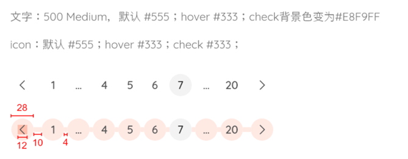

# Pagination说明

| 属性               | 说明                             | 类型                    | 默认值               | 支持     |
| ------------------ | -------------------------------- | ----------------------- | -------------------- | -------- |
| onChange           | 页码改变时的回调                 | （current） => any      | -                    |          |
| className          | 为pagination增加类用以设置其位置 | string \| CSSProperties | -                    |          |
| showPage           | 一次显示的页数                   | number                  | 5                    |          |
| current            | 当前页                           | number                  | 1                    |          |
| pageSize           | 每页条数                         | number                  | 20                   |          |
| total              | 总条数                           | number                  | -                    |          |
| *hideOnSinglePage* | 只有一页时是否隐藏分页器         | boolean                 | false                | 暂不支持 |
| *pageSizeOptions*  | 指定每页显示多少条               | string[]                | string[10,20,50,100] | 暂不支持 |
| *showQuickJumper*  | 是否可以快速跳转到某页           | boolean                 | false                | 暂不支持 |
| *showSizeChanger*  | 是否展示页面切换器               | boolean                 | true                 | 暂不支持 |


## 使用方式


```react
<ReoPagination
    total={ 50 } // 总条数
    onChange={(current) => handleChange(current)} // 获取当前值
    className={...}
    showPage={5} // 单次显示的页码范围
    current={1} // 当前页
    pageSize={20} // 每页显示条数
/>
```

